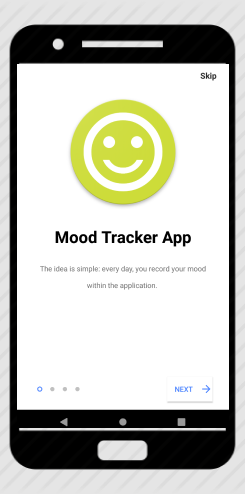
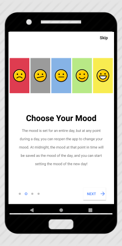
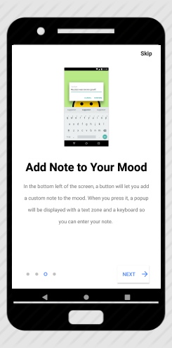
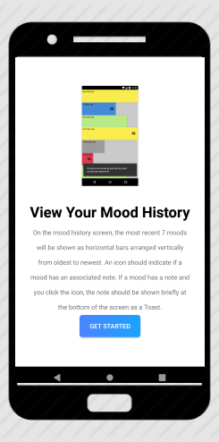
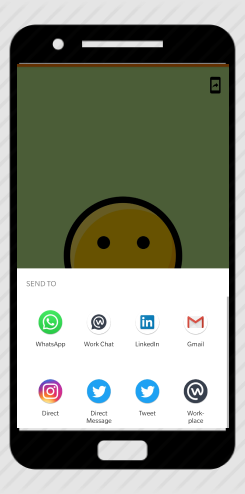

# MoodTracker App

**OpenClassrooms Project 6: Android MoodTracker App**

 The idea is simple: every day, you record your mood within the application. if you want, you can add a note to give more information on  _why_  you're feeling a certain way (ex. "I got a new job! 😃" or "There was no cheesecake left for dessert 😞 ").

Your mood history is saved for a week, allowing you see your general mood trends. Any comment you've left can also be consulted.

**MoodTracker website**
[MoodTracker website for more information](https://moodtrackersite.netlify.com/)

## Screenshots

 &ensp; &ensp;
&ensp;&ensp;

## Skills and learnig goals

-   Respect Industry Standard development practices
    
-   Select the appropriate programming languages for the development of the application
    
-   Develop an application offering the features expected by the client
    
-   Launch an application on the emulator or on real equipment
    
-   Master the life cycle of an application and its components
    
-   Use the Android Studio environment
    
-   Write a Java unit test
    
-   Debug Android code
    
-   Install and use an external library

## Libraries Used

* [Android Support Library](https://developer.android.com/topic/libraries/support-library/)

## Developed By

[**Mutwakil Mo**](https://mutwakilmo.netlify.com/)

## License

    Copyright 2019 Mutwakil Mo

    Licensed under the Apache License, Version 2.0 (the "License");
    you may not use this file except in compliance with the License.
    You may obtain a copy of the License at

         http://www.apache.org/licenses/LICENSE-2.0

    Unless required by applicable law or agreed to in writing, software
    distributed under the License is distributed on an "AS IS" BASIS,
    WITHOUT WARRANTIES OR CONDITIONS OF ANY KIND, either express or implied.
    See the License for the specific language governing permissions and
    limitations under the License.
    
